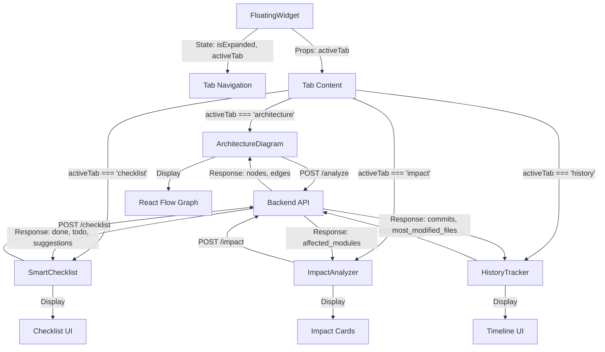

# Boby Frontend Architecture

## Component Hierarchy

```
App.jsx
└── FloatingWidget.jsx (Main Container)
    ├── Tab Navigation Bar
    │   ├── Architecture Tab
    │   ├── Checklist Tab
    │   ├── Impact Tab
    │   └── History Tab
    │
    └── Tab Content (Conditional Rendering)
        ├── ArchitectureDiagram.jsx
        │   ├── React Flow Canvas
        │   ├── Custom Nodes (Risk-colored)
        │   └── Node Tooltip
        │
        ├── SmartChecklist.jsx
        │   ├── Done Section
        │   ├── Todo Section
        │   ├── Suggestions Section
        │   ├── Refresh Button
        │   └── Export Button
        │
        ├── ImpactAnalyzer.jsx
        │   ├── File Input Field
        │   ├── Submit Button
        │   └── Results Cards (Risk Badges)
        │
        └── HistoryTracker.jsx
            ├── Timeline Container
            └── Commit Cards
                ├── Hash + Message
                ├── Author + Date
                └── Files Changed List
```

## Data Flow Diagram



## State Management

### FloatingWidget State
```javascript
{
  isExpanded: boolean,        // Widget expanded/collapsed
  activeTab: string,          // 'architecture' | 'checklist' | 'impact' | 'history'
}
```

### ArchitectureDiagram State
```javascript
{
  nodes: Array<Node>,         // Graph nodes from API
  edges: Array<Edge>,         // Graph edges from API
  loading: boolean,           // API call in progress
  error: string | null,       // Error message
  selectedNode: Node | null,  // Currently selected node for tooltip
}
```

### SmartChecklist State
```javascript
{
  done: Array<string>,        // Completed items
  todo: Array<string>,        // Pending items
  suggestions: Array<string>, // Suggestions
  loading: boolean,
  error: string | null,
}
```

### ImpactAnalyzer State
```javascript
{
  filename: string,           // Input filename
  affectedModules: Array<Module>, // Impact results
  loading: boolean,
  error: string | null,
  graph: {nodes, edges},      // Cached graph for analysis
}
```

### HistoryTracker State
```javascript
{
  commits: Array<Commit>,     // Commit history
  mostModifiedFiles: Array<File>, // High-frequency files
  loading: boolean,
  error: string | null,
}
```

## API Integration Flow

### 1. Architecture Tab Load
```
User clicks widget → Widget expands → Architecture tab active
→ useEffect triggers → api.analyze(workspacePath)
→ Backend scans repo → Returns {nodes, edges}
→ React Flow renders graph → User can click nodes
```

### 2. Checklist Refresh
```
User clicks Refresh → api.checklist(repoContext)
→ Backend analyzes repo → Returns {done, todo, suggestions}
→ UI updates with new checklist
```

### 3. Impact Analysis
```
User enters filename → Clicks Submit → api.impact(filename, graph)
→ Backend calculates dependencies → Returns {affected_modules}
→ UI displays risk cards
```

### 4. History Load
```
History tab activated → useEffect triggers → api.history(workspacePath)
→ Backend reads git log → Returns {commits, most_modified_files}
→ Timeline renders with commits
```

## Styling Architecture

### Theme System
- Base colors: Purple gradient (600-800)
- Background: Gray-900 (dark)
- Text: White/Gray-100
- Accents: Purple-500
- Risk colors: Red-500, Orange-500, Green-500

### Responsive Behavior
- Widget: Fixed dimensions (60x60 collapsed, 420x580 expanded)
- Internal scrolling: Each tab content scrollable
- No viewport responsiveness needed (fixed widget)

### Animation System
- Expand/collapse: 300ms ease-in-out transform + size
- Tab switch: 200ms fade-in
- Hover effects: 150ms transitions
- Loading spinners: Continuous rotation

## File Organization

```
src/
├── App.jsx                 # Root component
├── main.jsx               # React entry point
├── index.css              # Global styles + Tailwind
│
├── services/
│   └── api.js             # Centralized API calls
│
├── widget/
│   ├── FloatingWidget.jsx      # Main container
│   ├── ArchitectureDiagram.jsx # React Flow graph
│   ├── SmartChecklist.jsx      # Checklist UI
│   ├── ImpactAnalyzer.jsx      # Impact analysis
│   ├── HistoryTracker.jsx      # Git timeline
│   ├── MergeIntelligence.jsx   # Merge conflict detection
│   └── PushGuardian.jsx        # Pre-push validation
│
└── utils/                 # (Optional) Helper functions
    ├── formatDate.js      # Date formatting
    └── exportMarkdown.js  # Markdown export logic
```

## Key Design Decisions

### 1. Why Fixed Positioning?
- Always accessible during development
- Doesn't interfere with main content
- Familiar pattern (like chat widgets)

### 2. Why React Flow?
- Built for graph visualization
- Handles complex layouts automatically
- Interactive out of the box
- Customizable styling

### 3. Why Single Widget Container?
- Simpler state management
- Consistent UX
- Easier to maintain
- Better performance

### 4. Why Tab-based Navigation?
- Clear separation of concerns
- Familiar UX pattern
- Easy to extend with new tabs
- Reduces visual clutter

### 5. Why Auto-fetch on Mount?
- Better UX (no extra clicks)
- Assumes current workspace is target
- Can be overridden if needed
- Faster workflow

## Performance Considerations

### Optimization Strategies
1. **Lazy Loading**: Load React Flow only when Architecture tab active
2. **Memoization**: Use React.memo for expensive components
3. **Debouncing**: Debounce file input in Impact Analyzer
4. **Caching**: Cache graph data to avoid re-fetching
5. **Virtual Scrolling**: For large commit histories (if needed)

### Bundle Size
- React Flow: ~200KB (largest dependency)
- Lucide Icons: ~50KB (tree-shakeable)
- Total estimated: ~300KB gzipped

## Error Handling Strategy

### API Errors
- Network errors: Show retry button
- 404 errors: Show "Repository not found"
- 500 errors: Show "Server error, try again"
- Timeout: Show "Request timed out"

### User Errors
- Invalid file path: Show inline validation
- Empty results: Show "No data available"
- Git not initialized: Show helpful message

### Fallback UI
- Loading states for all async operations
- Skeleton screens for better perceived performance
- Error boundaries to catch React errors

## Future Enhancements

### Potential Features
1. **Settings Tab**: Configure API URL, theme, auto-refresh
2. **Search**: Search across commits, files, dependencies
3. **Filters**: Filter by risk level, file type, date range
4. **Notifications**: Alert on high-risk changes
5. **Export**: Export graphs as PNG/SVG
6. **Keyboard Shortcuts**: Quick access to tabs
7. **Drag & Drop**: Reposition widget
8. **Resize**: Make widget resizable
9. **Multiple Workspaces**: Switch between projects
10. **AI Suggestions**: Smart recommendations based on changes

## Development Phases

### Phase 1: Foundation (Steps 1-3)
- Project setup
- Basic widget structure
- Expand/collapse functionality

### Phase 2: Core Features (Steps 4-10)
- Tab navigation
- All 4 tab components
- API integration

### Phase 3: Polish (Steps 11-13)
- Theming
- Animations
- Error handling

### Phase 4: Testing (Steps 14-15)
- Component testing
- Integration testing
- Bug fixes

## Success Criteria

✅ Widget expands/collapses smoothly
✅ All tabs functional and switch correctly
✅ Architecture diagram displays with correct colors
✅ Checklist can be refreshed and exported
✅ Impact analysis shows affected files
✅ History timeline displays commits
✅ All API calls work with backend
✅ Dark purple theme applied consistently
✅ No console errors
✅ Responsive within fixed dimensions